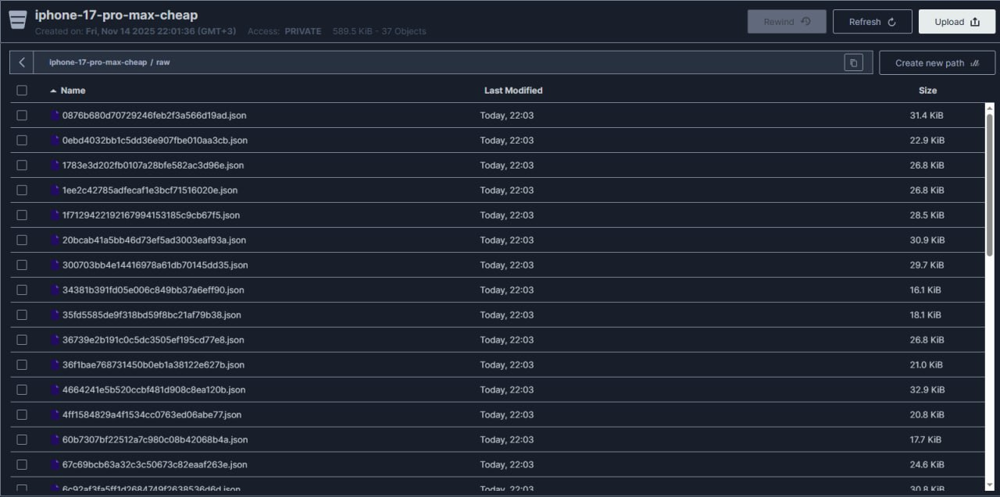
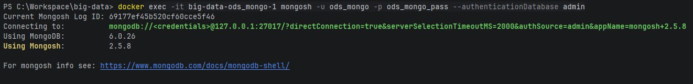

# Технологии хранения больших данных

**Выполнили:** Погрибняк Иван Сергеевич, Лапин Антон Владимирович  
**Источники данных:** Avito, hh.ru

---

## Лабораторная работа №1 "Работа с Airflow. ETL-процесс"

### Цель работы
Реализация ETL-процессов для сбора и загрузки данных о вакансиях и товарах в хранилище (слой ODS). Выбор и аргументация базы данных, оркестрация процессов с помощью Apache Airflow.

---

## Этапы выполнения

- [x] Развернуть сервис **Airflow** в Docker-контейнере с использованием docker-compose
- [x] Выбрать **3 различных сервиса для хранения данных**: PostgreSQL, MongoDB, MinIO (S3-совместимое хранилище)
- [x] Добавить конфигурацию для развертывания хранилищ в docker-compose
- [x] Реализовать **3 ETL-процесса** (DAG-ов) для Avito и hh.ru
- [x] Выгрузить данные во все выбранные базы данных
- [x] Провести **сравнительный анализ** хранилищ данных

---

## Отчёт

### Подготовка окружения

Перед началом реализации ETL-процессов была выполнена подготовка окружения:

1. **Создание рабочей директории** и настройка проекта
2. **Получение docker-compose.yaml** из официальной документации Airflow
3. **Настройка переменных окружения** в файле `.env`:
   - `AIRFLOW_USER`, `AIRFLOW_PASSWORD` - учетные данные администратора
   - `AIRFLOW_CONN_ODS_POSTGRES` - строка подключения к PostgreSQL
   - `AIRFLOW_CONN_ODS_MONGO` - строка подключения к MongoDB
4. **Добавление сервисов хранения данных** в docker-compose.yml:
   - **PostgreSQL** - реляционная БД для структурированных данных
   - **MongoDB** - документоориентированная БД для гибкого хранения
   - **MinIO** - S3-совместимое объектное хранилище для файлов и JSON
5. **Настройка volumes** для сохранения данных:
   - `postgres_data`, `mongo_data`, `minio_data`
6. **Инициализация Airflow** с помощью скрипта `init_airflow.sh`:
   - Инициализация БД Airflow
   - Создание администратора
   - Настройка подключений к хранилищам
7. **Запуск сервисов**: `docker-compose up -d`
8. **Веб-интерфейс Airflow** доступен по адресу: http://localhost:8080

### Инициализация структур данных

Перед запуском ETL-процессов был выполнен DAG `init_db` для создания необходимых структур:

- **PostgreSQL**: создание таблиц через `create_tables.sql`
- **MongoDB**: создание коллекций в БД `ods_mongo_db`
- **MinIO**: создание бакетов для разных типов данных

### Реализация ETL-процессов

Было разработано три DAG, каждый из которых реализует отдельный сценарий сбора данных.

#### DAG 1. iphone_17_pro_max_cheap_etl - мониторинг цен на технику Apple

**Цель:** отслеживание ценовых предложений на iPhone 17 Pro Max на платформе Avito в Москве и Санкт-Петербурге.

***Этапы ETL:***
- **Extract**: парсинг страниц Avito с помощью Selenium, сбор данных об объявлениях
- **Transform**: обработка данных - извлечение цены, локации, рейтинга продавца, статуса "новый"
- **Load**: загрузка в три целевых хранилища:
  - **PostgreSQL**: структурированные данные в таблицу `iphone_ads`
  - **MongoDB**: полные документы с raw HTML в коллекцию `iphone_ads`
  - **MinIO**: JSON-документы и изображения товаров

**Особенности:** 
- Обработка 20 объявлений из каждого города
- Сохранение изображений товаров в MinIO
- Ежедневное выполнение для отслеживания динамики цен

#### DAG 2. avito_vacancies_etl - сбор вакансий Data Engineer с Avito

**Цель:** сбор актуальных данных о вакансиях Data Engineer с платформы Avito для анализа рынка труда.

***Этапы ETL:***
- **Extract**: парсинг страниц поиска вакансий по запросу "Data Engineer"
- **Transform**: парсинг зарплаты (регулярные выражения), нормализация данных
- **Load**: загрузка в хранилища:
  - **PostgreSQL**: структурированные данные в таблицу `avito_vacancies`
  - **MongoDB**: полные документы с исходным HTML в коллекцию `avito_vacancies`
  - **MinIO**: JSON-документы с сырыми данными

**Особенности:**
- Сложный парсинг зарплатных вилок (от, до, тип)
- Обработка до 50 вакансий из каждого города
- Ежедневное обновление данных

#### DAG 3. hh_vacancies_etl - анализ вакансий Data Engineer с hh.ru

**Цель:** получение данных о вакансиях Data Engineer с HeadHunter через API для сравнения с данными Avito.

***Этапы ETL:***
- **Extract**: запросы к REST API hh.ru, получение структурированных данных
- **Transform**: нормализация данных зарплаты, работодателя, даты публикации
- **Load**: загрузка в хранилища:
  - **PostgreSQL**: структурированные данные в таблицу `hh_vacancies`
  - **MongoDB**: полные JSON-ответы API в коллекцию `hh_vacancies`
  - **MinIO**: сырые ответы API в виде JSON-файлов

**Особенности:**
- Использование официального API вместо парсинга
- Обработка зарплатных данных (from/to)
- Ежедневное обновление данных

### Демонстрация хранилищ данных

# PostgreSQL

# minIO

# Mongo

